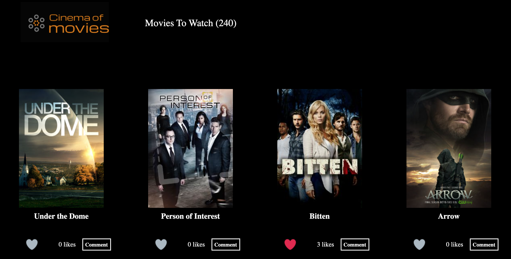

# The Capstone Project JS 


> This Webapp **The Cenima of Movies** displays a list of shows. The user is able to like any of the movies, and also read more information about each movie once he clicks on the "comments" button. Also, the user is able to leave a comment about any of the movies.


## Built With

- HTML
- CSS
- JavaScript
- Webpack

## Live Demo 

[Live Demo Link](https://thecapstone-project-js.netlify.app/)

## Video Dem
[Video Demo Link](https://www.loom.com/)


## Getting Started


To get a local copy up and running follow these simple example steps.


- clone the repository by running
``` git clone https://github.com/Tobinchilongo/JavaScript_Capstone.git ```
- navigate to the folder
``` cd JavaScript_Capstone ```
- Install packages
``` npm install ```
- Run the app
``` npm start ```
## Prerequisites
- Linters
- GitHub Flow
- Javascript
- WEBPACK
- Jest
### Run tests
Run the test 
`npm run test`

## Authors

👤 **Author 1: Tobin Chilongo Jnr**
 

- GitHub: [@Tobinchilongo](https://github.com/Tobinchilongo)
- Twitter: [@Tobin_Official](https://twitter.com/Tobin_Official)
- LinkedIn: [@Tobin Chilongo](https://www.linkedin.com/in/tobin-chilongo-a6736415a/)

👤 **Author 2: Selma Belhadj**

- GitHub: [@selma-belhadj](https://github.com/selma-belhadj)
- Twitter: [@Bel_Selma16](https://twitter.com/Bel_Selma16)
- LinkedIn: [@selma-belhadj](https://www.linkedin.com/in/selma-belhadj/)

## 🤝 Contributing

Contributions, issues, and feature requests are welcome!

Feel free to check the [issues page](../../issues/).

## Show your support

Give a ⭐️ if you like this project!


## 📝 License

This project is [MIT](./MIT.md) licensed.
